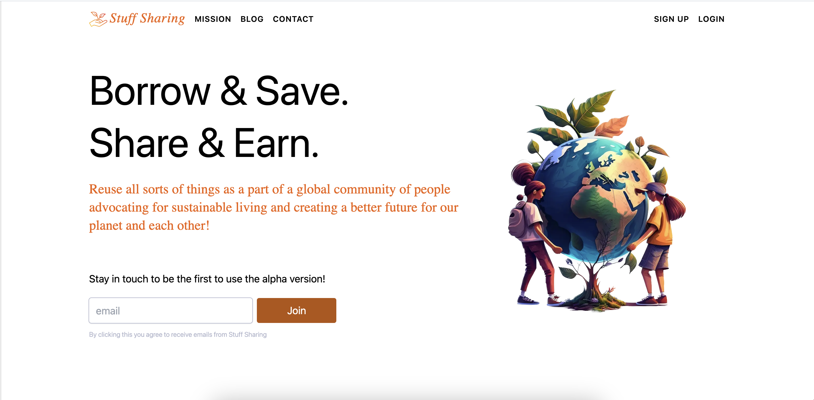
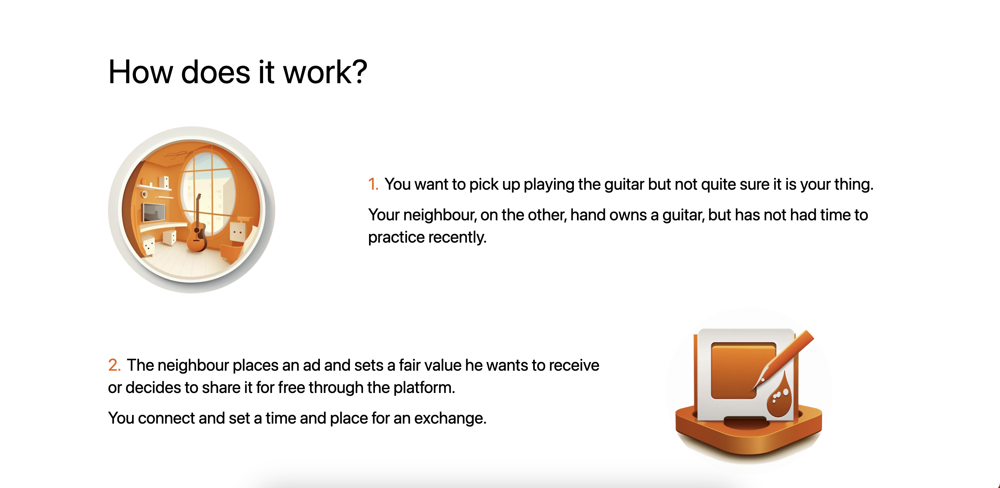
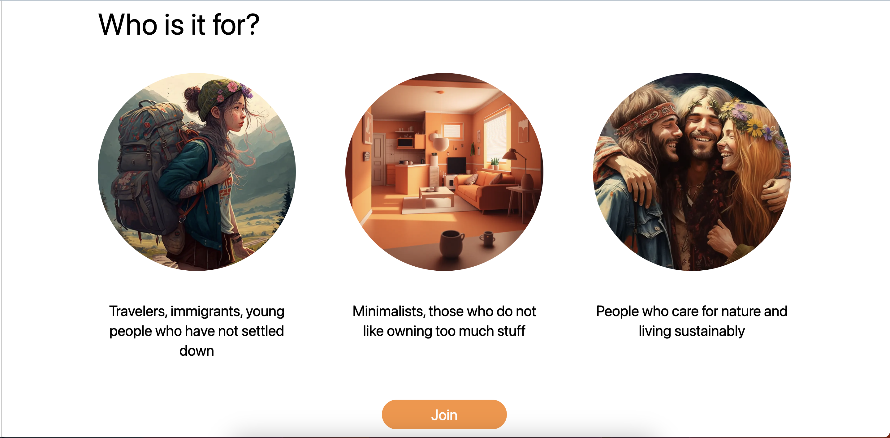

# Stuff Sharing Landing Page

This is a landing page for an online platform. Showcase of frontend only.

## Table of contents

- [Overview](#overview)
  - [The challenge](#the-challenge)
  - [Screenshot](#screenshot)
  - [My process](#my-process)
  - [Built with](#built-with)
  - [What I learned](#what-i-learned)
  - [Continued development](#continued-development)
- [Author](#author)
- [Acknowledgments](#acknowledgments)

## Overview

### The challenge

- Create a UI, that explains the mission of the project in a comprehensive way and promts users to leave their details.
Honestly, no challenge, I had to make it done, turned out nice, decided to upload it here. If didn't turn out good, wouldn't have shown :)

### Screenshot

## My process

### Built with

- NextJs
- Tailwind
- Mudjourney :P

### What I learned

- Designing and implementing a landing page in 1 day.

### Continued development

In the future I would like to add features as:

- Connection to a database to store emails
- Login and signup pages

## Authors

Anya Joy - @AnyaJoy

## Acknowledgments

This application was created thanks 3 cups of coffee and midjourney that covers my questionable design abilities.
